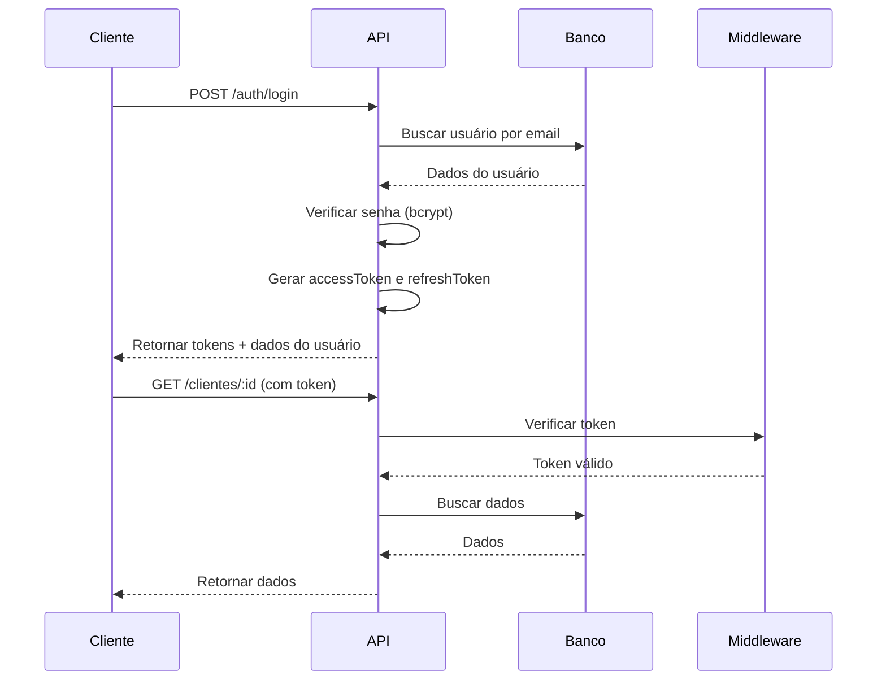

# 🔐 API de Autenticação - Cliente

Microsserviço completo de autenticação com JWT e gerenciamento de clientes.

## 🚀 Funcionalidades

### ✅ Autenticação Completa

- ✅ Login
- ✅ JWT (Access Token + Refresh Token)
- ✅ Refresh Token para renovação automática
- ✅ Logout com blacklist de tokens
- ✅ Rate limiting contra ataques de força bruta

### 🔒 Segurança

- ✅ Senhas criptografadas com bcrypt
- ✅ Middlewares de autenticação e autorização
- ✅ Validação de permissões por tipo de usuário
- ✅ Proteção contra ataques de força bruta
- ✅ CORS configurado para frontend

### 👥 Gestão de Usuários

- ✅ CRUD completo de clientes
- ✅ Status de usuários (Ativo, Inativo, Bloqueado, Suspenso)
- ✅ Upload de foto de perfil em Base64

## 📋 Pré-requisitos

- Node.js 16+
- MySQL 5.7+
- npm ou yarn

## ⚙️ Instalação

1. Clone o repositório

```bash
git clone <seu-repositorio>
cd cliente-adm-app
```

2. Instale as dependências

```bash
npm install
```

3. Configure as variáveis de ambiente

```bash
cp .env.example .env
# Edite o arquivo .env com suas configurações
```

4. Configure o banco de dados MySQL

5. Inicie o servidor

```bash
npm run dev
```

## 🗄️ Variáveis de Ambiente

Copie o arquivo `.env.example` para `.env` e configure as variáveis:

```bash
cp .env.example .env
```

### Variáveis Obrigatórias

```env
# Configurações de JWT (⚠️ OBRIGATÓRIO - mude em produção!)
JWT_SECRET=sua_chave_secreta_super_segura_aqui_mude_em_producao
JWT_REFRESH_SECRET=sua_chave_refresh_token_super_segura_aqui_mude_em_producao

# Banco de Dados
DB_HOST=localhost
DB_USER=root
DB_PASSWORD=sua_senha
DB_NAME=nome_do_banco
```

### Variáveis Opcionais (com valores padrão)

```env
# Servidor
PORT=3001                           # Porta do servidor (padrão: 3001)
NODE_ENV=development                # Ambiente: development ou production

# JWT (tempos de expiração)
JWT_EXPIRES_IN=15m                  # Tempo de expiração do access token (padrão: 15m)
JWT_REFRESH_EXPIRES_IN=7d           # Tempo de expiração do refresh token (padrão: 7d)

# Banco de Dados
DB_PORT=3306                        # Porta do MySQL (padrão: 3306)

# CORS
FRONTEND_URL=http://localhost:5173  # URL do frontend (padrão: *)

# Upload
MAX_FILE_SIZE_MB=5                  # Tamanho máximo de arquivo em MB (padrão: 5)

# Segurança
BCRYPT_SALT_ROUNDS=10               # Rounds do bcrypt (padrão: 10)
```

### 📝 Notas Importantes

- **JWT_SECRET e JWT_REFRESH_SECRET**: São obrigatórios! Use chaves longas e aleatórias em produção
- **FRONTEND_URL**: Configure corretamente para evitar problemas de CORS
- **DB_PASSWORD**: Em produção, sempre use uma senha forte
- **NODE_ENV=production**: Em produção, algumas validações adicionais serão executadas

## 🔐 Autenticação e Autorização

### Como usar tokens JWT

1. Faça login e receba o `accessToken` e `refreshToken`
2. Use o `accessToken` no header de todas as requisições protegidas:

```http
Authorization: Bearer {accessToken}
```

3. Quando o `accessToken` expirar (15 min por padrão), use o `refreshToken` para obter um novo
4. No logout, ambos os tokens são invalidados

## 🛡️ Segurança Implementada

1. **Rate Limiting**: Máximo 5 tentativas de login em 15 minutos
2. **Bcrypt**: Senhas criptografadas com salt rounds = 10
3. **JWT**: Tokens assinados e com expiração
4. **Blacklist**: Tokens invalidados após logout
5. **CORS**: Configurado para aceitar apenas origens confiáveis
6. **Validações**: UUID, email, CPF, senha mínima

## 🏗️ Estrutura do Projeto

```
cliente-adm-app/
├── src/
│   ├── controllers/
│   │   ├── AuthController.js        # Lógica de autenticação
│   │   └── ClienteController.js     # CRUD de clientes
│   ├── models/
│   │   ├── BaseModel.js             # Modelo base
│   │   └── ClienteModel.js          # Modelo de cliente
│   ├── middlewares/
│   │   └── authMiddleware.js        # Autenticação e autorização
│   ├── routes/
│   │   ├── authRoutes.js            # Rotas de autenticação
│   │   └── clienteRoutes.js         # Rotas de clientes
│   ├── utils/
│   │   └── ValidationUtils.js       # Utilitários de validação
│   ├── db/
│   │   └── database.js              # Conexão com banco
│   └── app.js                       # Configuração do Express
├── server.js                        # Servidor principal
├── .env.example                     # Exemplo de variáveis de ambiente
├── package.json
└── README.md
```

## 🔄 Fluxo de Autenticação



## 📝 Próximos Passos (Melhorias Futuras)

- [ ] Implementar recuperação de senha via email
- [ ] Implementar verificação de email para novos usuários
- [ ] Usar Redis para armazenar refresh tokens e blacklist
- [ ] Implementar 2FA (autenticação de dois fatores)
- [ ] Adicionar logs de auditoria
- [ ] Implementar tentativas de login falhadas
- [ ] Adicionar webhooks para eventos importantes
- [ ] Criar testes automatizados (Jest)
- [ ] Adicionar Swagger para documentação automática
- [ ] Implementar OAuth2 (Google, Facebook, etc)
